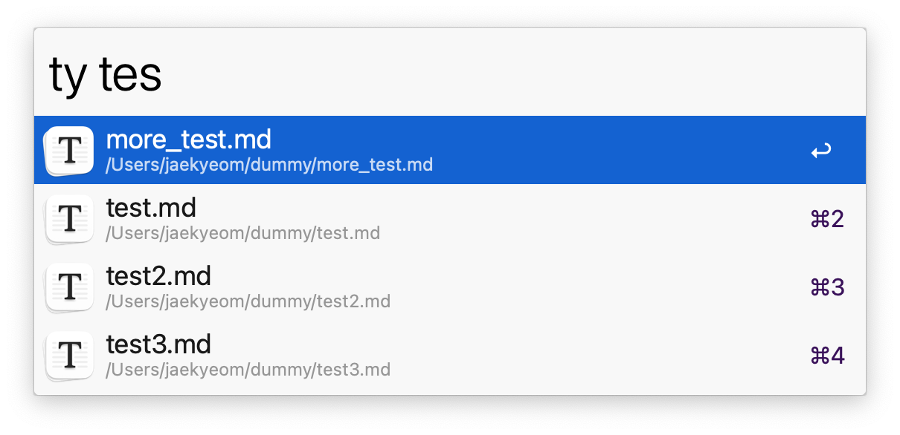

# Alfred Typora Workflow

Alfred workflow for querying and opening/closing [Typora](https://typora.io/) documents.  
It automatically searches the Git repositories or directories for markdown files, by default.

## Installation

Download and install [Typora-Documents.alfredworkflow](https://github.com/jaekyeom/alfred-typora-workflow/releases/latest/download/Typora-Documents.alfredworkflow).

## Usage

- `ty {query}`: Query Typora documents.
  - `↩`: Open/activate the selected document.
  - `⌥ + ↩`: Close the selected document (if it's open).
  - `⌘ + ↩`: Reveal file in Finder.

## Configurations

- `LIST_ONLY_OPEN_DOCS`: If set to 0 (default), it queries open documents and markdown files from the parent Git repositories or directories. If set to 1, it only queries open documents.
- `NUM_RECENT_DIRS`: The number of recent directories to keep and list files from. Set this to 0 to disable it. 5 by default.

## Credits

- [alfred-browser-tabs](https://github.com/epilande/alfred-browser-tabs) for the structure of the workflow.
- [OneUpdater](https://github.com/vitorgalvao/alfred-workflows/tree/master/OneUpdater) for the automatic updater node.

## License

MIT

